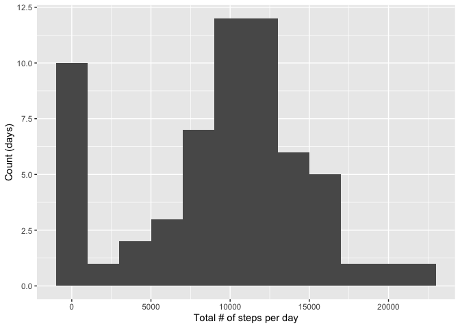
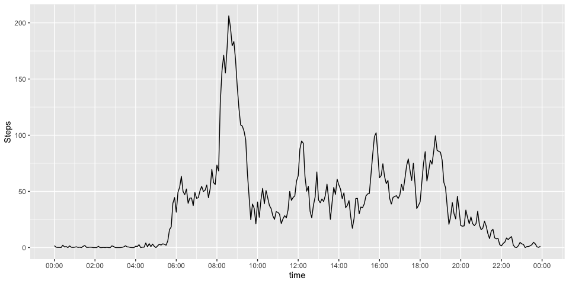
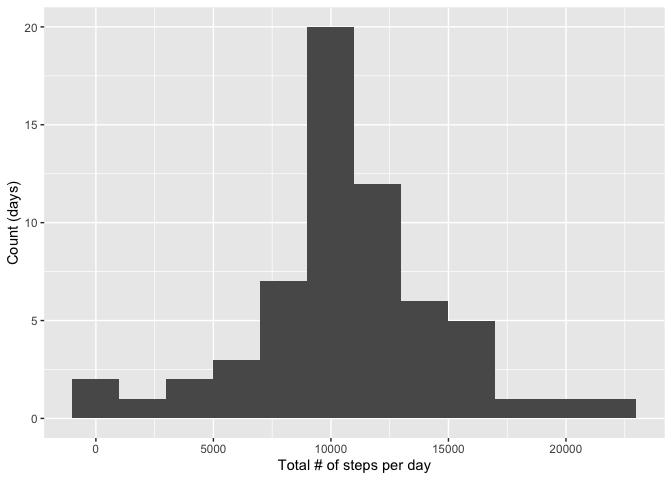
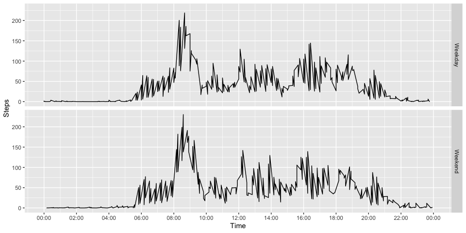

## Loading and preprocessing the data
First we load the data from the file "activity.csv" and change the class of the 
column date from factor to date. 

```r
library(lubridate)
library(stringr)
ds <- read.csv("activity.csv") ##Reading the file
ds$date <-as.Date(ds$date) ##Changing the class to date
head(ds)
```

```
##   steps       date interval
## 1    NA 2012-10-01        0
## 2    NA 2012-10-01        5
## 3    NA 2012-10-01       10
## 4    NA 2012-10-01       15
## 5    NA 2012-10-01       20
## 6    NA 2012-10-01       25
```

## What is mean total number of steps taken per day?
The distribution of the total number of steps taken each day can be observed in the histrogram below. 

```r
library(ggplot2)
steps_day<-tapply(ds$steps,ds$date, sum, na.rm=TRUE) ##Total number of steps by day
qplot(steps_day, geom="histogram", xlab="Total # of steps per day", ylab="Count (days)", binwidth=2000) 
```



```r
mean_steps<-mean(steps_day) ##Calculates the mean number of steps
median_steps<-median(steps_day) ##Calculates the median number of steps
```
The **mean** is 9354.2295082 and the **median** is 10395

## What is the average daily activity pattern?
Below is a time series plot of the 5-minute interval (x-axis) and the average number of steps taken, averaged across all days (y-axis). 

```r
time.padded <- str_pad(names(tapply(ds$steps,ds$interval, mean, na.rm=TRUE)), 4, pad="0") ##Makes all intervals contain 4 digits, 2 for hours and 2 for minutes
mins  <-  substr(time.padded, nchar(time.padded)-1, nchar(time.padded)) ##subtract minutes
hour  <-  substr(time.padded, 0, nchar(time.padded)-2) #substract hours
time  <-  paste0(hour, ':', mins) ##join hours and minutes with : in between
y<- tapply(ds$steps,ds$interval, mean, na.rm=TRUE) ##Calculates mean for each interval across all days
dataplot <- data.frame(time=as.POSIXct(paste0("2016-09-23 ", time), tz = "GMT")) ##An arbitrary date is chosen as we are only interested in the time
dataplot$y <- y
ggplot(dataplot, aes(x = time, y = y)) + geom_line() +  scale_x_datetime(date_labels = "%H:%M", date_breaks = "2 hour") +ylab("Steps")
```



```r
max_interval<-time[which.max(dataplot$y )]
```
The 5 minutes interval with the maximum average number of steps is the interval that starts at 08:35.

## Imputing missing values

```r
number_na<-sum(is.na(ds$steps))
```
There are 2304 missing values in the dataset. The missing values will be imputed by assigning the mean of that 5 minutes interval across all the days. A new dataset named `ds2` has been created with the missing data filled in.   


```r
interval_na<- data.frame(interval=ds[is.na(ds$steps), 3], index = which(is.na(ds$steps))) ##Intervals with NAs  and their index
avg_interval <- data.frame(average= y, interval=names(y)) ## contains average steps for each interval
merged <- merge(interval_na, avg_interval, by="interval") ##Merges both data frames based on the interval
ds2<-ds ##Clones the original data set 
ds2[merged$index, 1] <- merged$average ##Imputs the data
head(ds2)
```

```
##       steps       date interval
## 1 1.7169811 2012-10-01        0
## 2 0.3396226 2012-10-01        5
## 3 0.1320755 2012-10-01       10
## 4 0.1509434 2012-10-01       15
## 5 0.0754717 2012-10-01       20
## 6 2.0943396 2012-10-01       25
```
A new histrogram of the total number of steps taken each day is presented below. It can be seen that the number of days with almost zero steps has practically disappeared. The distribution looks Gaussian. 

```r
steps_day2<-tapply(ds2$steps,ds2$date, sum, na.rm=TRUE) ##calculates the total number of steps per day
qplot(steps_day2, geom="histogram", xlab="Total # of steps per day", ylab="Count (days)", binwidth=2000) 
```



```r
mean_steps2<-mean(steps_day2) ##Calculates the mean
median_steps2<-median(steps_day2) ##Calculates the median
```
The **new mean** is 10766.19 compared to the **old mean** which is 9354.2295082. The **new median** is 10766.19 compared to the **old median** which is 10395. In general, the mean and the median have increased slightly after imputing the data. 

## Are there differences in activity patterns between weekdays and weekends?
We first create a new column in `ds2` called `classification` that indicates if a give date is a weekday or a weekend. 

```r
ds2$classification <- weekdays(ds2$date) ##Assign the corresponding day for a given datte
ds2$classification<-ifelse(ds2$classification %in% c("Saturday", "Sunday"), "Weekend", "Weekday") ##Transform the day into a factor, either Weekday or Weekend
head (ds2)
```

```
##       steps       date interval classification
## 1 1.7169811 2012-10-01        0        Weekday
## 2 0.3396226 2012-10-01        5        Weekday
## 3 0.1320755 2012-10-01       10        Weekday
## 4 0.1509434 2012-10-01       15        Weekday
## 5 0.0754717 2012-10-01       20        Weekday
## 6 2.0943396 2012-10-01       25        Weekday
```

Next, we create a panel plot containing a time series plot of the 5-minute interval (x-axis) and the average number of steps taken, averaged across all weekday days or weekend days (y-axis).

```r
y2<-t(tapply(ds2$steps,list(ds2$classification,ds2$interval), mean)) ##Calculates the mean by factor, for each interval
y2<-as.data.frame(y2)
dataplot2 <- data.frame(Steps = c(y2$Weekday,y2$Weekend), Classification= c(rep("Weekday", length(y2)), rep("Weekend", length(y2))),Time = rep(dataplot$time,2))
p <- ggplot(dataplot2, aes(Time, Steps)) + geom_line() + scale_x_datetime(date_labels = "%H:%M", date_breaks = "2 hour")
p + facet_grid(Classification~.)
```


It can be seen that the activity patterns are similar. The most active period is between 8:00 and 9:00. 
